Your task is to create or update a pull request based on the provided input. You are capable of interpreting both git diff output and the GitHub's PR template located in `$HOME/.cursor/skills/create-pr-global/pull_request_template.md` on this repository root. Take a deep breath and follow these steps:

**CRITICAL: ALWAYS USE THE SCRIPTS (via `bash`)**
- **DO NOT** use local `git log`, `git diff`, or any local git commands to get the PR contents
- **ALWAYS** invoke scripts with `bash` (never execute them directly; they may lack the executable bit):
  - Fetch diff: `bash $HOME/.cursor/skills/create-pr-global/show-pr-diff-on-create.sh`
  - Update PR: `bash $HOME/.cursor/skills/create-pr-global/update-pr.sh`
- The fetch script ensures you get the correct diff that matches what's in the PR, not just local changes
- This is the ONLY approved method to retrieve PR contents for analysis

AUTOMATIC INPUT HANDLING (no user prompt required)

```mermaid
flowchart TD
    Start([Start: Receive Input]) --> CheckJira{Jira MCP<br/>available?}

    CheckJira -->|Yes| ExtractTicket[Extract Jira ticket<br/>from branch name via<br/>git branch --show-current]
    CheckJira -->|No| SkipJira[Proceed without<br/>Jira context]

    ExtractTicket --> TicketFound{Ticket ID<br/>found?}
    TicketFound -->|Yes| FetchJira[Read ticket + parent<br/>tickets via jira MCP]
    TicketFound -->|No| OfferCreate{Offer to create<br/>Jira ticket?}
    OfferCreate -->|Yes| CreateTicket[Create ticket<br/>via jira MCP]
    OfferCreate -->|No| SkipJira
    CreateTicket --> FetchJira
    FetchJira --> JiraContext[Store Jira context<br/>for PR description]
    JiraContext --> CheckInput

    SkipJira --> CheckInput{Determine Input Type}

    CheckInput -->|PR URL/Number| ExtractPR[Extract PR Number]
    CheckInput -->|Branch Name| UseBranch[Use Branch Name]
    CheckInput -->|No Input/Auto| UseCurrentBranch[Use Current Branch]

    ExtractPR --> FetchDirect[Execute: gh pr diff PR_NUMBER]

    UseBranch --> RunScript[Execute:<br/>bash show-pr-diff-on-create.sh]
    UseCurrentBranch --> RunScript

    RunScript --> CheckScriptResult{Script<br/>successful?}

    CheckScriptResult -->|No: gh CLI not installed| ErrorNoGH[ERROR:<br/>gh CLI not installed]
    CheckScriptResult -->|No: Not authenticated| ErrorNoAuth[ERROR:<br/>Not authenticated]
    CheckScriptResult -->|No: No branch name| ErrorNoBranch[ERROR:<br/>No branch name]
    CheckScriptResult -->|No: Branch not on remote| DetectNotPushed[Detect Error:<br/>Branch not pushed]
    CheckScriptResult -->|No: PR creation failed| ErrorPRFailed[ERROR:<br/>Failed to create PR]
    CheckScriptResult -->|Yes| FetchDiff[Get PR Diff Output]

    DetectNotPushed --> PromptPush{Prompt: Would you<br/>like me to push<br/>the branch now?}

    PromptPush -->|No| ErrorNotPushed[ERROR:<br/>User declined push]
    PromptPush -->|Yes| PushBranch[Execute:<br/>git push -u origin branch]

    PushBranch --> VerifyPush{Push<br/>successful?}
    VerifyPush -->|No| ErrorPushFailed[ERROR:<br/>Push failed]
    VerifyPush -->|Yes| RetryScript[Re-run Script]

    RetryScript --> CheckScriptResult

    FetchDirect --> AnalyzeDiff[Analyze Diff Output]
    FetchDiff --> AnalyzeDiff

    AnalyzeDiff --> FulfillTemplate[Fulfill PR Template<br/>enriched with Jira<br/>context if available]
    FulfillTemplate --> GenerateCommand[Generate update-pr.sh<br/>command with HEREDOC body]
    GenerateCommand --> ExecuteCommand[Execute: bash update-pr.sh<br/>title and body]
    ExecuteCommand --> CheckExecution{Command<br/>successful?}

    CheckExecution -->|No| ErrorExecution[ERROR:<br/>Command execution failed]
    CheckExecution -->|Yes| ReportSuccess[SUCCESS:<br/>PR updated with link]

    ReportSuccess --> End([End])
    ErrorExecution --> End
    ErrorNoGH --> End
    ErrorNoAuth --> End
    ErrorNoBranch --> End
    ErrorNotPushed --> End
    ErrorPushFailed --> End
    ErrorPRFailed --> End

    style ErrorNoGH fill:#ffcccc,stroke:#cc0000
    style ErrorNoAuth fill:#ffcccc,stroke:#cc0000
    style ErrorNoBranch fill:#ffcccc,stroke:#cc0000
    style ErrorNotPushed fill:#ffcccc,stroke:#cc0000
    style ErrorPushFailed fill:#ffcccc,stroke:#cc0000
    style ErrorPRFailed fill:#ffcccc,stroke:#cc0000
    style ErrorExecution fill:#ffcccc,stroke:#cc0000
    style DetectNotPushed fill:#fff4cc,stroke:#ffaa00
    style PromptPush fill:#cce5ff,stroke:#0066cc
    style PushBranch fill:#cce5ff,stroke:#0066cc
    style RetryScript fill:#cce5ff,stroke:#0066cc
    style FetchDiff fill:#ccffcc,stroke:#00cc00
    style GenerateCommand fill:#ccffcc,stroke:#00cc00
    style ExecuteCommand fill:#ccffcc,stroke:#00cc00
    style ReportSuccess fill:#ccffcc,stroke:#00cc00
    style CheckJira fill:#e6ccff,stroke:#9933ff
    style ExtractTicket fill:#e6ccff,stroke:#9933ff
    style FetchJira fill:#e6ccff,stroke:#9933ff
    style JiraContext fill:#e6ccff,stroke:#9933ff
    style CreateTicket fill:#e6ccff,stroke:#9933ff
```



## Step 1: Jira Context (OPTIONAL)

This step is **optional** and depends on the `jira` MCP being available. If it is not configured or fails, skip entirely and proceed to Step 2.

1. Try to extract a Jira ticket ID from the current branch name (`git branch --show-current`). Common patterns: `PROJ-123`, `feat/PROJ-123-description`, etc.
2. If a ticket ID is found and `jira` MCP is available:
   - Read the ticket and its parent tickets for context (the WHY behind the changes)
   - Store this context to enrich the PR title and "Motivation and Context" section
3. If no ticket ID is found and `jira` MCP is available:
   - Offer the user the option to create a Jira ticket (focus on WHY, not WHAT)
   - If user declines or MCP is unavailable, proceed without Jira context
4. If `jira` MCP is not available: skip this step silently

## Step 2: Determine Input Type

1. First, determine the type of input provided:
   - **PR Link/Number**: If input is a PR URL (e.g., `https://github.com/quintoandar/frontend-webapps/pull/123`) or just a number (e.g., `123` or `#123`), extract the PR number
   - **Branch Name**: If input is a branch name, use the `show-pr-diff-on-create.sh` script to get the diff
   - **Auto**: Use the `show-pr-diff-on-create.sh` script without passing arguments. It will create the PR if needed and return the diff.

## Step 3: Fetch PR Diff

Fetch the PR diff using the appropriate method (NEVER use local git commands):
   - **For PR number/link**: Use `gh pr diff <PR_NUMBER>` directly to fetch the diff from GitHub
   - **For branch name/auto**: Execute `bash $HOME/.cursor/skills/create-pr-global/show-pr-diff-on-create.sh [BRANCH_NAME]` which will create the PR if it doesn't exist and fetch the diff from GitHub
   - **DO NOT** use `git log`, `git diff`, or any local git commands to get PR contents
   - **DO NOT** invoke the script without `bash` prefix (direct execution may fail with "permission denied")

**Parse PR metadata from script output**:
   - The script prints `PR_METADATA_NUMBER=<n>` and `PR_METADATA_URL=<url>` before the diff
   - Use these lines for the PR number and link in Step 5 (do not guess from colored log lines)

**Handle "Branch not pushed to remote" error**:
   - If the script fails with the error message "Branch '<BRANCH_NAME>' is not pushed to remote!", detect this error
   - Extract the branch name from the error message
   - Prompt the user: "The branch '<BRANCH_NAME>' is not pushed to remote. Would you like me to push it now?"
   - If user confirms:
     - Execute `git push -u origin <BRANCH_NAME>`
     - If push succeeds: Re-run the script to continue with PR creation
     - If push fails: Report the error to the user
   - If user declines: Inform them they need to push the branch manually before proceeding

## Step 4: Analyze and Generate PR Content

1. Analyze the provided changes from the diff output.
2. Identify the type of changes being made (e.g., new files, renamed files, modified files, deleted files).
3. Understand the context of ALL the changes, including file paths and the nature of the modifications.
4. Fulfill the PR template (`$HOME/.cursor/skills/create-pr-global/pull_request_template.md`) based on the diff and any Jira context gathered in Step 1:
   - If Jira context is available, use it to write a richer "Motivation and Context" section explaining the WHY
   - If Jira ticket IDs are available, include them in the PR title using conventionalcommits format: `feat(PROJ-123): <summary>`
   - If no Jira context, write the PR based solely on the diff analysis
   - Keep text short and objective. This will be reviewed by other engineers.

## Step 5: Execute IMMEDIATELY (NO confirmation)

**CRITICAL BEHAVIOR RULES:**
1. **ALWAYS** update the PR with both title and body. NEVER leave the PR without a description.
2. **NEVER** ask the user for confirmation. Generate the content and execute the update command immediately.
3. **NEVER** output the full PR description to the user. Be concise in your response.
4. **ALWAYS** include the PR link (e.g., `https://github.com/org/repo/pull/123`) in your final response.

OUTPUT INSTRUCTIONS
* **DO NOT** use `gh pr edit`. It fails on repos with GitHub Projects (classic) due to a GraphQL deprecation error.
* **ALWAYS** update the PR with `update-pr.sh`, piping the body via HEREDOC on stdin:

```bash
bash $HOME/.cursor/skills/create-pr-global/update-pr.sh <PR_NUMBER> "<title>" <<'EOF'
<body in markdown>
EOF
```

* Use `PR_METADATA_NUMBER` from the fetch script output as `<PR_NUMBER>` when the PR was just created or found by branch.
* When input was a PR number/link only, use that number directly.
* The body should use the PR template (`$HOME/.cursor/skills/create-pr-global/pull_request_template.md`) fulfilled in markdown format.
* **EXECUTE the command immediately** without asking for user approval.
* Your final response to the user should ONLY contain: a brief summary of what was done and the PR link. Do NOT output the full description.

DIFF INTERPRETATION
* When analyzing the diff, consider both traditional git diff format and GitHub's PR diff summary format.
* For GitHub's PR diff summary:
  * Look for file renaming patterns (e.g., "File renamed without changes.")
  * Identify new file additions (e.g., lines starting with "+")
  * Recognize file deletions (e.g., lines starting with "-")
  * Understand all file modifications by analyzing the changes in content
* Adjust your interpretation based on the format of the provided diff information.
* Ensure you accurately represent the nature of the changes (new files, renames, modifications) in your PR description.
* Ensure you follow ALL these instructions when creating your output.

IMPORTANT NOTES
* **ALWAYS** invoke skill scripts with `bash <path>`; never run them as bare executables
* **ALWAYS** use `bash show-pr-diff-on-create.sh` to get PR contents; NEVER use local git log or git diff commands
* **ALWAYS** use `bash update-pr.sh` to set title and body; NEVER use `gh pr edit`
* The fetch script handles PR creation automatically if a PR does not exist
* The scripts require `gh` CLI installed and authenticated; `update-pr.sh` also requires `jq`
* If a PR number is provided, skip the fetch script and use `gh pr diff` directly to get the GitHub PR diff (not local diff)
* Jira MCP integration is **optional**; if unavailable or failing, proceed without it
* **ALWAYS** update the PR description immediately after analyzing the diff; do NOT wait for confirmation
* **ALWAYS** include the PR link in the final response (prefer `PR_METADATA_URL` from script output)

GitHub CLI Installation Instructions:
- macOS: `brew install gh` or download from https://cli.github.com/

INPUT: @Branch (Diff with Main) OR PR Link/Number (e.g., https://github.com/quintoandar/frontend-webapps/pull/123 or just 123)
